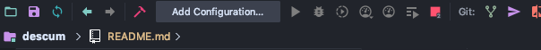
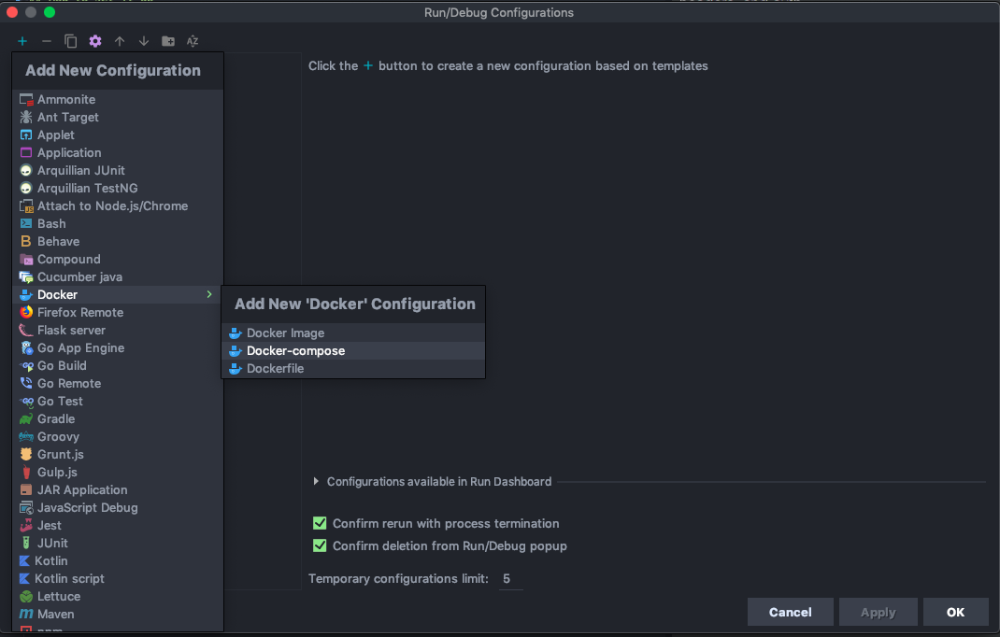
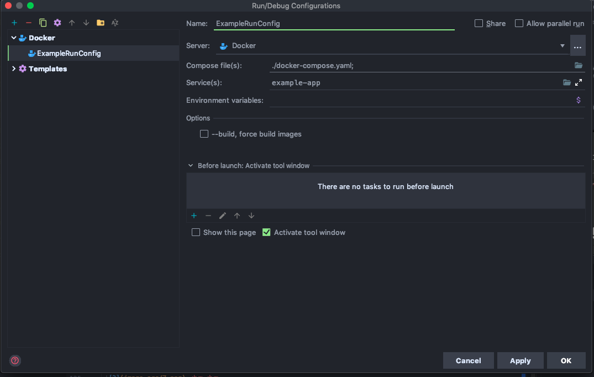
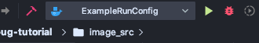
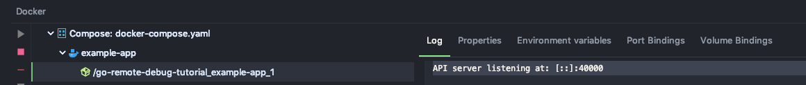
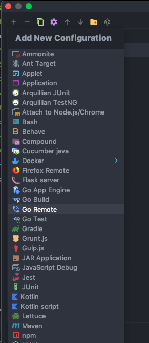
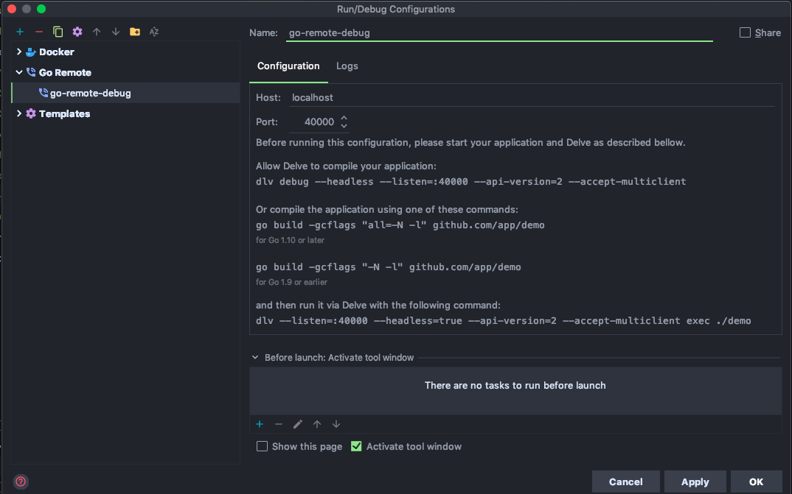
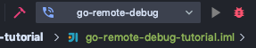
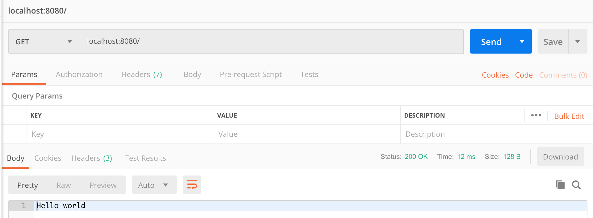
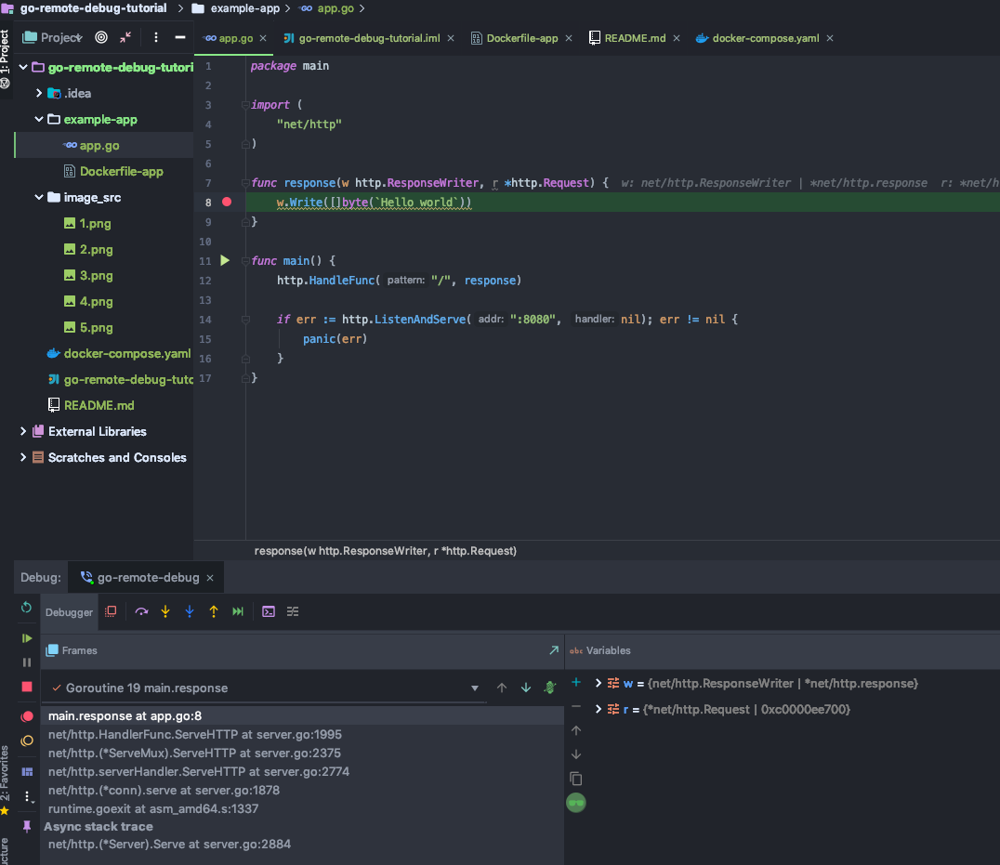

# Remote Debugging Containerized Go Applications
#### A guide by Jacky Zhao

Below is a quick, basic tutorial on how to use IntelliJ's Go plugin to debug
Go applications running in Docker containers. To do this, we build the containers
with a tool called Delve, the Go debugger.

## 0. Pre-requisites

Before we start, ensure that you have both the Go and Docker Integration plugins installed.
`Settings > Plugins > Install JetBrains Plugin > Docker integration` <br>
`Settings > Plugins > Install JetBrains Plugin > Go`

## 1. Create the app.

For this tutorial, we will be using this basic Go 'Hello World' program as our 'app.'
<b> PLEASE make sure this project is created under a VALID GOPATH! <br>e.g. `~/go/src/go-remote-debug-tutorial/example-app/app.go`</b>

```go
package main

import (
	"net/http"
)

func response(w http.ResponseWriter, r *http.Request) {
	w.Write([]byte(`Hello world`))
}

func main() {
	http.HandleFunc("/", response)

	if err := http.ListenAndServe(":8080", nil); err != nil {
		panic(err)
	}
}
```

## 2. Create the dockerfile

Create a file called `Dockerfile-app` under the `example-app` directory
with the following contents.

```dockerfile
## Create Builder Container
FROM golang:1.12.0-alpine3.9 as builder
ENV CGO_ENABLED 0

# Make sure this path mirrors what you have in $GOPATH
ADD . /go/src/go-remote-debug-tutorial/example-app/

# Install requirements for the app
RUN apk add --no-cache git

# Compile the app WITHOUT optimization flags, allows Delve to
# provide a better debug experience. This creates an executable `server`
# and looks under `go-remote-debug-tutorial/example-app` for the Go files.
RUN go build -gcflags "all=-N -l" -o /server go-remote-debug-tutorial/example-app

# Install Delve
RUN go get github.com/derekparker/delve/cmd/dlv

## Create Instance Container, we use Alpine to reduce size
FROM alpine:3.7
 
# Allow delve to run on Alpine based containers.
RUN apk add --no-cache libc6-compat

# Expose debug port and application port
EXPOSE 40000 8080

# Set current working directory
WORKDIR /

# Copy the compiled executable to root
COPY --from=builder /server /
# Copy the delve executable to root
COPY --from=builder /go/bin/dlv /

# Run Delve on port 40000 on 
CMD /dlv --listen=:40000 --headless=true --api-version=2 --accept-multiclient exec ./server
```

To make it easier to scale this for larger applications where there may be
multiple services that need to be running at once, we create a `docker-compose.yaml`
under the root directory.

```dockerfile
version: "3.7"
services:
  example-app:
    build:
      context: ./example-app
      dockerfile: Dockerfile-app
    expose:
      - "8080"
      - "40000"
    ports:
      - "40000:40000"
      - "8080:8080"
    security_opt:
      - "apparmor:unconfined"
    cap_add:
      - "SYS_PTRACE"
```

## 3. Creating the run configuration

Conveniently, IntelliJ has something called `Run Configurations` which allow us to run all of our docker images
from within the IDE. Here's how to set it up and use it.

1. First, we want to edit our `Run/Debug Configurations`. Click on Add Configuration. <br><br>
 <br><br>
2. Then we want to add a new configuration of Docker Compose under `+ > Docker > Docker-compose`. These run configs 
allow us to start the container quickly through IntelliJ.<br><br>
 <br><br>
3. Fill in the details as follows. Select the `docker-compose.yaml` file for the field `Compose File(s)`. Add 
services as needed. Under services, add the name of your service (as defined in your `docker-compose.yaml`), in this case: `example-app`.<br><br>
 <br><br>
4. Now, we can run all the containers at once with this `Run Config`. <br><br>
 <br><br>
5. Voila! You should see Delve listening on port `40000` with this debug message: `API server listening at: [::]:40000
` <br><br>
 <br><br>

Note: At this point, you should NOT be able to hit the endpoint via curl or Postman because we haven't started IntelliJ's debugger yet.

## 4. Debugging the application

1. Next, we need to add a new configuration for Go Remote under `+ > Go Remote`. This lets us debug our
containerized Go application through IntelliJ.<br><br>
 <br><br>
2. Set it up as follows. The default port we normally use for Delve is `40000` <br><br>
 <br><br>
3. We can then connect to the Delve instance in the container by running the `go-remote-debug` 
Debug Configuration that we just made by hitting the red bug. <br><br>
 <br><br>
4. Go ahead and set some breakpoints in `app.go`! Now when you hit the service, it should stop at the 
breakpoints.
 <br><br>
 <br><br>

Enjoy remote debugging :) If you'd like to see a more complex example or would want to know how to use
Envoy with this, check out this repo: https://github.hootops.com/internal-tools/social-gateway-front-proxy